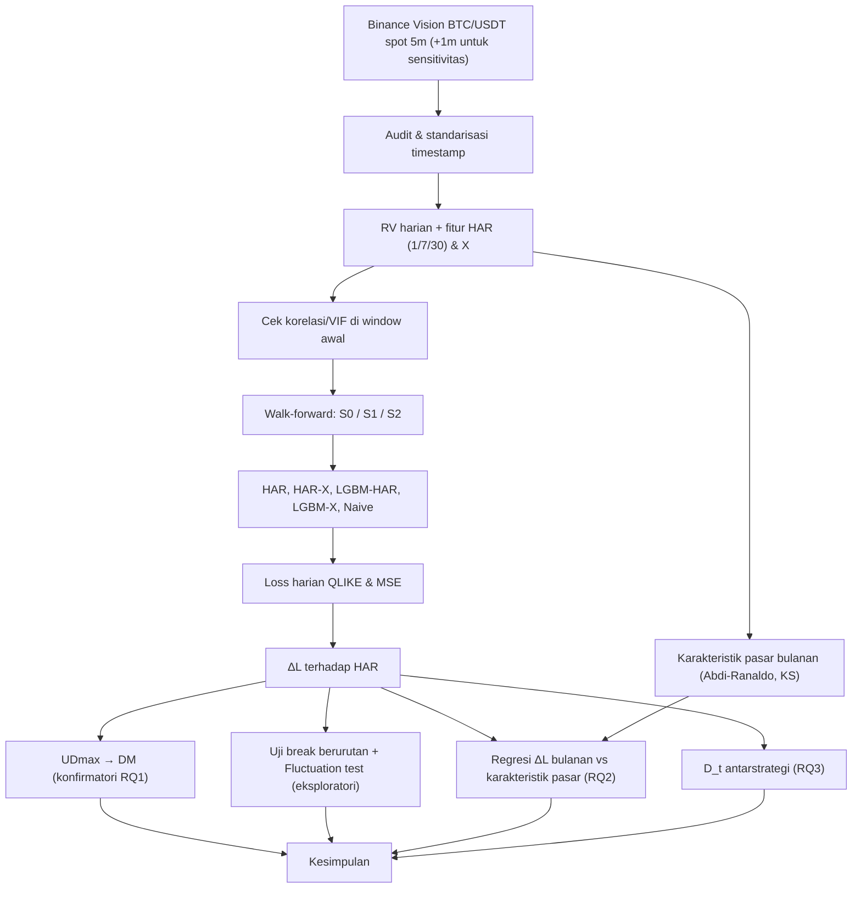

# Riset Skripsi v2.5: Stabilitas Keunggulan Machine Learning dalam Prediksi Realized Volatility Bitcoin

> Status: **kandidat desain, konsep lengkap**. Belum ada eksperimen. Referensi bertanda ⚠ atau DOI bertanda \* wajib diverifikasi sendiri (buka DOI, cek kuartil SCImago) sebelum masuk proposal.
>
> **Notasi:** BTC/USDT = pasar spot; BTCUSDT (tanpa garis miring) = perpetual. Pengecualian: nama simbol file arsip Binance.
>
> **Legenda status referensi:** ✅F = full text dibaca · ✅F(WP) = dibaca versi working paper, kutip versi terbit · ✅A = abstrak dibaca · ✅M = metadata/DOI terverifikasi, isi belum dibaca · ⚠ = belum dicek

---

## 0. Ringkasan Perubahan

### Update v2.5 (setelah diskusi lanjutan)

| Aspek | v2.4 | v2.5 | Dasar |
|---|---|---|---|
| Kandidat judul | Tiga kandidat lama dengan istilah "Realized Volatility" dan "Keunggulan" | **Dua kandidat baru** (maks. 15 kata): "Kinerja Relatif", "HAR-RV", "Realized Variance" | Konsisten dengan target realized variance dan objek analisis ΔL; batas 15 kata |
| Efisiensi pasar vs keterramalan volatilitas | Belum dibahas | Paragraf pembeda di Sintesis + butir di Bagian X | Yi et al. (2023), Mokni et al. (2024), Do (2026) bicara efisiensi **return**; riset ini meramal **volatilitas** |
| Rantai argumen proxy | Tersebar | Dirangkum: Andersen & Bollerslev (1998) → Patton (2011) → Liu et al. (2015) | Satu alur untuk RV 5 menit + QLIKE |

### Update v2.4 (hasil pembacaan full text 34 paper)

| Aspek | v2.3 | v2.4 | Dasar |
|---|---|---|---|
| Uji konfirmatori RQ1 | Fluctuation test, μ = 0,3 | **UDmax** pada rata-rata ΔL; jika tidak menolak, uji DM. Fluctuation test jadi visualisasi eksploratori | Hipotesis nol GR = sama akurat di setiap titik, bukan "stabil"; daya uji GR rendah dan tidak monoton setelah koreksi HAC (Martins & Perron, 2016); strategi UDmax lebih dulu (Bai & Perron, 2003) |
| Skema uji formal | "Validitas GR untuk expanding perlu dicek" | Uji formal di **S2 (rolling)** | Kerangka Giacomini-White untuk metode peramalan dirumuskan untuk rolling/fixed (Rossi, 2013); rolling menyamakan panjang latih antarperiode (Tashman, 2000) |
| Lag HAR | 1, 5, 22 | **1, 7, 30** (sensitivitas 1, 5, 22) | BTC diperdagangkan 7 hari; logika horizon pelaku pasar (Corsi, 2009) |
| Definisi target | "RV" = Σr² | Ditegaskan sebagai **realized variance**; QLIKE dihitung pada skala varians | Corsi mendefinisikan RV sebagai akar; perlu eksplisit |
| Semivariance negatif | ln RS⁻ sebagai fitur | **Proporsi RS⁻/RV** sebagai fitur X | RV = RS⁻ + RS⁺ persis → kolinearitas di HAR-X; proporsi menjaga komponen HAR tetap utuh |
| Amihud | Rasio harian | **Realized Amihud** dari 288 bar 5 menit dengan volume dolar | Amihud (2002) dirancang sebagai rata-rata; mengikuti Do (2026) |
| Regresor likuiditas RQ2 | Rata-rata Amihud | **Abdi-Ranaldo** (Corwin-Schultz sensitivitas) | Abdi-Ranaldo terbaik menangkap variasi waktu likuiditas kripto; Amihud terbaik untuk level (Brauneis et al., 2021); log Amihud tidak stasioner (Do, 2026) |
| Variabel keempat RQ2 | "Covariate shift" | **Pergeseran distribusi fitur** (statistik KS) | Covariate shift formal mensyaratkan P(y\|x) tetap, yang tidak diuji (Moreno-Torres et al., 2012) |
| Klaim RQ3 | S1 vs S2 memisahkan efek jumlah vs relevansi data | S1 vs S2 menangkap **efek gabungan** jumlah dan umur data | Tashman (2000); pemisahan penuh butuh skema rolling tertunda (dipindah ke VII) |
| Dasar H2b | Do (2026) menunjukkan hubungan melemah | **Perluasan** dari Do: Do menguji volatilitas → illiquidity, bukan sebaliknya; ditambah Mokni et al. (2024) bahwa hubungan likuiditas bisa berbalik | Pembacaan full text Do |
| Dasar H3 | Argumen intuitif | **Trade-off bias–varians** Pesaran-Timmermann (via Rossi, 2013) + hipotesis tandingan | Rossi (2013); Gama et al. (2014); Suárez-Cetrulo et al. (2023) |
| Alasan LightGBM | Histogram-based → retraining cepat | Kinerja model pohon di data tabular (Grinsztajn et al., 2022); akurasi setara XGBoost | Histogram-based bukan kontribusi Ke et al. (2017); keunggulan kecepatan tidak relevan untuk ~3.000 baris |
| Sensitivitas proxy RV | RV 15 menit | **RV 5 menit subsampled** (butuh data 1 menit) + RV 15 menit | Liu, Patton & Sheppard (2015) |
| Tuning | "Time-series CV" | **Forward-chaining** (`TimeSeriesSplit`), bukan blocked k-fold | Cerqueira et al. (2020) |
| HAC | Newey-West | Newey-West dengan **bandwidth otomatis Andrews (1991)** | Konsisten dengan Martins & Perron (2016), Bai & Perron (2003) |
| Paper acuan | Belum ada | **Dudek et al. (2024)**; acuan metodologis kedua: Chassot & Audrino (2026) setelah dibaca full | Setting paling mirip, sudah dibaca full |
| Metadata | Beberapa salah | Koreksi: Audrino → **Chassot & Audrino (2026), IJF**; paper Computational Economics → **Akgun & Gulay (2025)**; "Zhang et al. (2024) NAJEF" → **Al-Yahyaee et al. (2020)**; Agakishiev et al. + **Zuo**; Yi et al. (2022) & survei 2026 **dibuang** | Pengecekan langsung |

**Keputusan desain v2.4 ditetapkan mengikuti rekomendasi** (lag 7/30, proporsi RS⁻/RV, Abdi-Ranaldo hanya di RQ2, klaim RQ3 dikoreksi tanpa skema tambahan, sensitivitas subsampled + 15 menit, kerangka istilah Moreno-Torres). Ubah bila dosen pembimbing mengarahkan lain.

### Riwayat singkat
- **v1:** "Apakah ML mengalami degradation saat pasar berubah?" (error absolut, trivial karena efek skala).
- **v2–v2.2:** reframing ke keunggulan relatif (ΔL), desain 2×2, strategi update, pemisahan referensi metode vs gap, verifikasi abstrak.
- **v2.3:** OOS dimulai ~Sep 2018, H3 ditulis ulang, uji konfirmatori + koreksi Holm, justifikasi data spot dan 5 menit, aturan teknis.

---

## I. Posisi Riset

### Pertanyaan utama
Dalam memprediksi realized volatility Bitcoin, **apakah keunggulan model machine learning atas baseline HAR stabil sepanjang waktu, atau muncul dan hilang mengikuti perubahan kondisi pasar?** Jika tidak stabil, karakteristik pasar apa yang berasosiasi dengan perubahannya, dan apakah strategi pembaruan model memengaruhinya?

### Kalimat inti (untuk dihafal)
> "Saya menguji apakah keunggulan machine learning atas model sederhana dalam meramal volatilitas Bitcoin itu stabil, atau muncul dan hilang mengikuti kondisi pasar."

### Paper acuan: Dudek et al. (2024), *Applied Soft Computing*

| Aspek | Dudek et al. (2024) | Riset ini |
|---|---|---|
| Hasil | Satu angka agregat untuk 2019–2021 | Kestabilan keunggulan relatif diuji sepanjang waktu (UDmax, Fluctuation test) |
| Kondisi pasar | MAE di 5% hari RV terendah/tertinggi, tanpa uji | Regresi ΔL terhadap karakteristik pasar dengan uji formal (RQ2) |
| Strategi window | Satu skema (rolling 23 bulan, retrain harian) | Static vs expanding vs rolling, antarera (RQ3) |
| Periode | Berakhir 2021 | Era transisi dan institusional hingga 2026 |
| Sumber keunggulan | Tidak dipisahkan | Dekomposisi 2×2 (non-linearitas vs informasi tambahan) |

Kalimat posisi: *"Penelitian ini memperluas Dudek et al. (2024) dengan menguji apakah keunggulan relatif model machine learning atas HAR bersifat stabil sepanjang waktu, faktor pasar apa yang berasosiasi dengan perubahannya, serta bagaimana strategi pembaruan model memengaruhinya."*

### Kenapa framing ini kuat
1. **Menghindari temuan trivial.** Loss absolut naik saat volatilitas tinggi karena skala target. ΔL pada hari yang sama menetralkan efek ini; QLIKE juga homogen berderajat nol sehingga tidak bergantung skala (Patton, 2011).
2. **Pertanyaan praktis jelas:** kapan model ML layak dipakai dibanding model sederhana, dan bagaimana memperbaruinya.
3. **Kontribusi Informatika:** rancangan evaluasi model ML pada data yang berubah (strategi update dari literatur concept drift) dipadukan dengan uji kestabilan dari ekonometrika. Suárez-Cetrulo et al. (2023) mencatat literatur ML untuk data stream dan literatur deret waktu masih kurang terhubung.
4. **Hasil negatif tetap valid.**

### Yang TIDAK diklaim
- Tidak mengklaim *concept drift* maupun *covariate shift* dalam arti formal; yang diukur hanya pergeseran distribusi fitur.
- Tidak mengklaim menjelaskan microstructure Bitcoin; semua variabel pasar diturunkan dari OHLCV.
- Tidak mengklaim kausalitas; RQ2 asosiatif.
- Tidak mengklaim memisahkan efek jumlah dan umur data latih.
- Kesimpulan terbatas pada BTC/USDT spot di Binance.

---

## II. Konsep Kunci

| Konsep | Pengertian | Peran |
|---|---|---|
| Realized variance (RV) | Σ kuadrat return 5 menit dalam satu hari UTC (288 return) | Target |
| HAR-RV | Regresi RV pada rata-rata RV 1, 7, 30 hari (Corsi, 2009) | Baseline |
| QLIKE | Loss robust terhadap proxy berisik, homogen derajat nol (Patton, 2011) | Metrik utama |
| ΔL | `ΔL_t = L_t(ML) − L_t(HAR)`; negatif = ML unggul | Objek analisis |
| Forecast instability | Performa relatif berubah sepanjang waktu (Rossi, 2013) | Fenomena yang diuji |
| UDmax | Uji Bai-Perron untuk ≥1 perubahan rata-rata (hingga 5 break) | Uji konfirmatori RQ1 |
| Fluctuation test | Statistik DM bergulir dengan nilai kritis GR (2010) | Visualisasi eksploratori |
| Forecast breakdown | Loss OOS signifikan lebih buruk dari in-sample (Giacomini & Rossi, 2009) | Pembeda konsep |
| Pergeseran distribusi fitur | Perubahan P(x) antara window latih dan bulan uji (KS) | Regresor RQ2 |
| Updating vs recalibration | Data baru tanpa estimasi ulang vs estimasi ulang (Tashman, 2000) | S0 vs S1/S2 |
| Prequential in blocks | Latih-uji bergantian per blok, window tumbuh atau bergeser (Cerqueira et al., 2020) | Kerangka S1/S2 |
| Uji konfirmatori | Satu uji per RQ, ditetapkan sebelum melihat hasil OOS | Mencegah temuan kebetulan |
| Periode evaluasi bersama | Rentang saat semua strategi yang dibandingkan punya forecast | Dasar RQ3 |

**Perbandingan istilah drift (dipakai kerangka Moreno-Torres):**

| Perubahan | Gama et al. (2014) | Moreno-Torres et al. (2012) |
|---|---|---|
| P(x) berubah | *Virtual drift* (tanpa syarat soal P(y\|x)) | *Covariate shift* (syarat P(y\|x) tetap) |
| P(y\|x) berubah | *Real concept drift* (P(x) boleh berubah) | *Concept shift* (syarat P(x) tetap) |

Peramalan RV termasuk masalah X → Y (fitur hari t mendahului target t+1), sehingga kerangka covariate/concept shift yang relevan.

---

## III. Literatur

> **Aturan:** referensi metode & teori tanpa batas tahun; referensi research gap wajib 2021–2026.

### III.1 Referensi metode & teori

**Volatilitas, pengukuran, dan fitur**

| Referensi | DOI / ID | Status | Dipakai untuk |
|---|---|---|---|
| Andersen & Bollerslev (1998), *Answering the skeptics*, IER 39(4), 885–905 | 10.2307/2527343\* | ✅F | RV intraday sebagai proxy; proxy berisik membuat model tampak buruk |
| Corsi (2009), *A simple approximate long-memory model of realized volatility*, JFEC 7(2), 174–196 | 10.1093/jjfinec/nbp001 | ✅F(WP 2004) | HAR; lag; koefisien HAR berubah waktu (Gbr. 9 WP) |
| Liu, Patton & Sheppard (2015), *Does anything beat 5-minute RV?*, J. Econometrics 187(2), 293–311 | 10.1016/j.jeconom.2015.02.008 | ✅F | Resolusi 5 menit; subsampling |
| Parkinson (1980), *The extreme value method...*, J. Business 53(1), 61–65 | JSTOR 2352357; 10.1086/296071\* | ✅F | Fitur range |
| Barndorff-Nielsen, Kinnebrock & Shephard (2010), *Measuring downside risk: Realised semivariance*, bab dalam *Volatility and Time Series Econometrics*, OUP | — | ✅F(WP 2008) | Definisi RS⁻ |
| Patton & Sheppard (2015), *Good volatility, bad volatility*, REStat 97(3), 683–697 | 10.1162/REST_a_00503\* | ✅F | RS⁻ sebagai prediktor dalam HAR |
| Amihud (2002), *Illiquidity and stock returns*, JFM 5(1), 31–56 | 10.1016/S1386-4181(01)00024-6 | ✅F | Definisi Amihud (price impact) |
| Brauneis, Mestel, Riordan & Theissen (2021), *How to measure the liquidity of cryptocurrency markets?*, JBF 124, 106041 | 10.1016/j.jbankfin.2020.106041 | ✅F | Pilihan proxy likuiditas |

**Model ML**

| Referensi | DOI / ID | Status | Dipakai untuk |
|---|---|---|---|
| Ke et al. (2017), *LightGBM*, NeurIPS 30 | tanpa DOI | ✅F | Definisi LightGBM (GOSS, EFB; tumbuh leaf-wise) |
| Chen & Guestrin (2016), *XGBoost*, KDD | 10.1145/2939672.2939785\* | ⚠ | Pembanding pilihan LightGBM |
| Grinsztajn, Oyallon & Varoquaux (2022), *Why do tree-based models still outperform deep learning on typical tabular data?*, NeurIPS | arXiv 2207.08815\* | ⚠ (target ✅F) | Alasan utama model pohon |

**Metrik dan uji statistik**

| Referensi | DOI / ID | Status | Dipakai untuk |
|---|---|---|---|
| Patton (2011), *Volatility forecast comparison using imperfect volatility proxies*, J. Econometrics 160(1), 246–256 | 10.1016/j.jeconom.2010.03.034 | ✅F | QLIKE; koreksi bias; asimetri loss |
| Diebold & Mariano (1995), *Comparing predictive accuracy*, JBES 13(3) | 10.1080/07350015.1995.10524599\* | ⚠ | Uji DM |
| Newey & West (1987), Econometrica 55(3), 703–708 | JSTOR; 10.2307/1913610\* | ✅F | HAC |
| Andrews (1991), *Heteroskedasticity and autocorrelation consistent covariance matrix estimation*, Econometrica | cari | ⚠ | Bandwidth HAC otomatis |
| Giacomini & Rossi (2009), *Detecting and predicting forecast breakdowns*, REStud 76(2), 669–705 | 10.1111/j.1467-937X.2009.00545.x | ✅F | Konsep breakdown; preseden regresi RQ2 |
| Giacomini & Rossi (2010), *Forecast comparisons in unstable environments*, JAE 25(4), 595–620 | 10.1002/jae.1177 | ✅M (target ✅F) | Fluctuation test (visual) |
| Rossi (2013), *Advances in forecasting under instability*, Handbook of Economic Forecasting vol. 2, 1203–1324 | 10.1016/B978-0-444-62731-5.00021-X | ✅F (bagian relevan) | Survei; skema rolling; trade-off bias–varians |
| Martins & Perron (2016), *Improved tests for forecast comparisons in the presence of instabilities*, JTSA 37(5), 650–659 | 10.1111/jtsa.12179 | ✅F | Dasar UDmax pada ΔL |
| Bai & Perron (1998), Econometrica 66(1), 47–78 | JSTOR; 10.2307/2998540\* | ✅F | Definisi & nilai kritis UDmax |
| Bai & Perron (2003), *Computation and analysis of multiple structural change models*, JAE 18(1), 1–22 | 10.1002/jae.659 | ✅F | Strategi pemakaian UDmax, trimming |
| Andrews (1993), *Tests for parameter instability and structural change with unknown change point*, Econometrica | cari | ⚠ | sup-Wald |
| Hansen, Lunde & Nason (2011), *The model confidence set*, Econometrica 79(2), 453–497 | 10.3982/ECTA5771\* | ⚠ | Opsional |
| Holm (1979), Scand. J. Statistics 6(2), 65–70 | JSTOR 4615733 | ✅F | Koreksi uji berganda |
| Inoue & Rossi (2012), *Out-of-sample forecast tests robust to the choice of window size* | cari | ⚠ opsional | Sensitivitas ukuran window |

**Evaluasi dan adaptasi model**

| Referensi | DOI / ID | Status | Dipakai untuk |
|---|---|---|---|
| Tashman (2000), *Out-of-sample tests of forecasting accuracy*, IJF 16(4), 437–450 | 10.1016/S0169-2070(00)00065-0\* | ✅F | Banyak periode uji; updating vs recalibration; rolling menyamakan panjang latih |
| Cerqueira, Torgo & Mozetič (2020), *Evaluating time series forecasting models*, Machine Learning 109, 1997–2028 | 10.1007/s10994-020-05910-7 | ✅F | OOS untuk data tidak stasioner; forward-chaining; prequential blocks |
| Gama et al. (2014), *A survey on concept drift adaptation*, ACM CSUR 46(4), Art. 44 | 10.1145/2523813 | ✅F | Taksonomi window; agregat menyembunyikan perilaku model |
| Žliobaitė, Budka & Stahl (2015), *Towards cost-sensitive adaptation*, Neurocomputing 150, 240–249 | 10.1016/j.neucom.2014.05.084 | ✅F | S0 sebagai pembanding manfaat adaptasi |
| Moreno-Torres et al. (2012), *A unifying view on dataset shift in classification*, Pattern Recognition 45, 521–530 | 10.1016/j.patcog.2011.06.019 | ✅F | Definisi dataset/covariate/concept shift |
| Quiñonero-Candela et al. (eds.) (2009), *Dataset Shift in Machine Learning*, MIT Press, ISBN 978-0-262-17005-5 | buku | ⚠ (yang dibaca hanya resensi) | Dikutip lewat Moreno-Torres |
| Rabanser, Günnemann & Lipton (2019), *Failing loudly*, NeurIPS | arXiv 1810.11953\* | ⚠ | Uji KS per fitur |
| Suárez-Cetrulo, Quintana & Cervantes (2023), ESWA 213, 118934 | 10.1016/j.eswa.2022.118934 | ✅F | Recurring drift; jembatan ML–deret waktu |
| Arora et al. (2024), WIREs DMKD | 10.1002/widm.1536 | ✅M | Taksonomi drift terbaru |

### III.2 Referensi research gap (2021–2026)

**Pilar A — Evolusi pasar Bitcoin (konteks)**

| Referensi | DOI | Status | Kegunaan |
|---|---|---|---|
| Do (2026), *Maturation of Bitcoin market microstructure*, Borsa Istanbul Review 26, 100869 | 10.1016/j.bir.2026.100869 | ✅F | Batas era; persistensi RV per era (0,697/0,833/0,723); data 2012–Okt 2019 Bitstamp, Nov 2019–2025 Binance → besaran Amihud antarera tidak boleh dikutip |
| Mokni, El Montasser, Ajmi & Bouri (2024), Financial Innovation 10, 39 | 10.1186/s40854-023-00566-3 | ✅F | Efisiensi berganti-ganti; koefisien likuiditas berbalik pra/pasca COVID |
| Yi, Yang, Jeong, Sohn & Ahn (2023), Scientific Reports 13, 4789 | 10.1038/s41598-023-31618-4 | ✅F | Konteks efisiensi; data s.d. Mar 2019 |
| Zhang, Zhu, Li, Jin & Xia (2024), Financial Innovation 10, 3 | 10.1186/s40854-023-00532-z | ✅F | Proxy likuiditas harian di kripto |
| Al-Yahyaee et al. (2020), NAJEF 52, 101168 | 10.1016/j.najef.2020.101168 | ✅F | Konteks saja (2020, di luar batas gap) |

**Pilar B — Regime**

| Referensi | DOI | Status | Kegunaan |
|---|---|---|---|
| Agakishiev, Härdle, Becker & Zuo (2025), Digital Finance 7, 107–131 | 10.1007/s42521-024-00123-2 | ✅F | Manfaat regime hilang di data uji karena ketidakstasioneran |
| Oprea & Bâra (2026), Computational Economics (online first) | 10.1007/s10614-026-11338-3 | ✅F | Pembeda: target harga, tanpa HAR; R² baseline bulanan 0,07–0,84 |

**Pilar C — ML untuk volatilitas kripto**

| Referensi | DOI | Status | Kegunaan |
|---|---|---|---|
| **Dudek, Fiszeder, Kobus & Orzeszko (2024)**, Applied Soft Computing 151, 111132 | 10.1016/j.asoc.2023.111132 | ✅F | **Paper acuan** |
| Huang, Sangiorgi & Urquhart (2024), JIFMIM 97, 102064 | 10.1016/j.intfin.2024.102064 | ✅F | LSTM unggul tipis (~1,56%), OOS ~290 hari; HAR lebih baik saat lonjakan |
| Wang, Andreeva & Martin-Barragan (2023), IRFA 90, 102914 | 10.1016/j.irfa.2023.102914 | ✅F | Prediktor internal paling penting (kontras dengan Feng et al.) |
| Christensen, Siggaard & Veliyev (2023), JFEC 21(5), 1680–1727 | 10.1093/jjfinec/nbac020 | ✅M (target ✅F) | Rujukan utama ML vs HAR |
| Feng, Qi & Lucey (2024), IRFA 94, 103239 | 10.1016/j.irfa.2024.103239\* | ✅A (target ✅F) | Pembeda: variasi hyperparameter harian; importance fitur berubah sejak Okt 2022 |
| Qiu, Qu, Shi & Xie (2025), Economic Modelling 144, 106986 | 10.1016/j.econmod.2024.106986 | ✅M | Spesifikasi tetap tidak universal |
| Catania & Grassi (2022), *Forecasting cryptocurrency volatility*, IJF 38(3), 878–894 | cari | ⚠ | Konteks |
| Souto & Moradi (2024), *Introducing NBEATSX to realized volatility forecasting*, ESWA 242, 122802 | cari | ⚠ | Konteks |
| Berger & Koubová (2024), J. Forecasting 43(7), 2904–2916 | 10.1002/for.3165 | ✅A opsional | Target return, relevansi rendah |

**Pilar D — Uji instabilitas di kripto**

| Referensi | DOI | Status | Kegunaan |
|---|---|---|---|
| Trucíos & Taylor (2023), J. Forecasting | 10.1002/for.2929 | ✅A (target ✅F) | Fluctuation test untuk VaR/ES kripto, model ekonometrik |
| *Forecasting Realized Volatility with Time Series Foundation Models* (2026) | arXiv 2607.05291 | ✅A | Preprint pendukung |

**Pilar E — Window training**

| Referensi | DOI | Status | Kegunaan |
|---|---|---|---|
| Chassot & Audrino (2026), *HARd to beat*, IJF 42(2), 330–343 | 10.1016/j.ijforecast.2025.06.003 | ✅A (target ✅F) | 1.445 saham; ML gagal mengalahkan HAR yang diberi skema fitting tepat. Acuan metodologis kedua |
| Akgun & Gulay (2025), Computational Economics 65, 3971–4013 | 10.1007/s10614-024-10694-2 | ✅F | Rolling vs expanding pada BTC (hanya GARCH), tanpa HAR, tanpa uji formal; contoh efek skala antar-rasio latih-uji |
| Feng (2024), *Rolling window, expanding window, or both?*, J. Forecasting 43(3), 567–582 | 10.1002/for.3046 | ✅M (target ✅F) | Dasar RQ3 |
| Di-Giorgi et al. (2025), Computational Statistics 40(6), 3229–3255 | 10.1007/s00180-023-01349-1 | ✅M | Efek ukuran training |
| Lima et al. (2022), IEEE Access | cari | ⚠ | Drift untuk regresi |
| Bakirov, Fay & Gabrys (2021), Machine Learning 110(6) | cari | ⚠ | Strategi adaptasi |

### III.3 Referensi dosen pembimbing dan lainnya

| Referensi | DOI | Status | Tempat |
|---|---|---|---|
| Parlika, Mustafid & Rahmat (2024), *Minimum, Maximum, and Average Implementation of Patterned Datasets in Mapping Cryptocurrency Fluctuation Patterns*, JOIV 8(1), 378–386 | 10.62527/joiv.8.1.1543 | ⚠ (dari pencarian) | Bab 1; pengambilan data API bursa |
| Parlika, Isnanto & Rahmat (2024), *Prediction of ROI Achievements... Using K-means Clustering and Patterned Dataset Model*, JOIV 8(3-2), 1987–2001 | 10.62527/joiv.8.3-2.3120 | ⚠ (dari pencarian) | Bab 2: dataset kondisi Crash/Moon → jembatan ke RQ2 |
| *Mapping Bitcoin Research in Information Systems: A Comprehensive Bibliometric Analysis (2008–2025)*, Jurnal Sisfokom (Parlika sebagai salah satu penulis) | cek | ⚠ opsional | Bab 1/2, posisi riset BTC di bidang SI |
| Nakamoto (2008), *Bitcoin: A peer-to-peer electronic cash system*, https://bitcoin.org/bitcoin.pdf | — | opsional | Satu kalimat pengenalan Bitcoin; tidak dihitung ke target |

### Status jumlah referensi

| Kelompok | ✅F | ✅A | ✅M | ⚠ |
|---|---|---|---|---|
| Metode & teori | 23 | 0 | 2 | 9 |
| Gap 2021–2026 + konteks | 11 | 5 | 4 | 4 |
| Dosen & lainnya | 0 | 0 | 0 | 4 |
| **Total** | **34** | **5** | **6** | **17** |

Catatan: Corsi dan Barndorff-Nielsen et al. dibaca versi working paper; Rossi (2013) dibaca bagian relevan. Target ≥30 full text tercapai. **Wajib full text sebelum/sesudah bimbingan pertama:** Chassot & Audrino (2026), Feng et al. (2024), Trucíos & Taylor (2023), Giacomini & Rossi (2010), Christensen et al. (2023), Feng (2024), Grinsztajn et al. (2022), Corsi (2009) versi jurnal.

### Sintesis literatur

1. Karakteristik pasar Bitcoin berubah substansial (Do, 2026), tapi tidak mulus: efisiensi naik-turun (Mokni et al., 2024) dan regime bisa berulang (Suárez-Cetrulo et al., 2023). **Bukan kontribusi.**
2. ML vs HAR untuk volatilitas kripto sudah banyak, hampir semuanya dengan satu periode uji dan hasil agregat (Huang et al., 2024; Wang et al., 2023; Dudek et al., 2024; Oprea & Bâra, 2026). Sebagian memakai loss yang tidak robust (MAPE, MAE, HMSE; Patton, 2011). **Benchmarking saja bukan kontribusi.**
3. Bahwa performa relatif berubah antarperiode uji sudah dikenal sejak lama (Tashman, 2000), dan literatur ML menegaskan rata-rata menyembunyikan perilaku model (Gama et al., 2014). Alat ujinya ada (Giacomini & Rossi, 2010; Martins & Perron, 2016; Rossi, 2013) dan sudah dipakai di kripto untuk VaR/ES (Trucíos & Taylor, 2023). **Menerapkan uji saja bukan kontribusi.**
4. Pilihan window berpengaruh, termasuk pada BTC (Akgun & Gulay, 2025; Feng, 2024), dan perbandingan ML vs HAR bisa bias bila HAR tidak diberi skema tepat (Chassot & Audrino, 2026). **"Window berpengaruh" bukan kontribusi.**
5. Jawaban soal fitur mana yang penting tidak stabil antarstudi dan antarperiode (Wang et al., 2023 vs Feng et al., 2024), dan arah hubungan likuiditas–efisiensi tidak sepakat (Al-Yahyaee et al., 2020; Do, 2026; Mokni et al., 2024).
6. **Efisiensi return ≠ volatilitas tidak bisa diramal.** Literatur efisiensi Bitcoin (Yi et al., 2023; Mokni et al., 2024; Do, 2026) menguji apakah **return** bisa diprediksi dari masa lalu. Pasar yang mendekati efisien dalam arti ini tetap bisa memiliki volatilitas yang terprediksi, karena volatilitas mengelompok (hari bergejolak diikuti hari bergejolak), dan itulah yang dimanfaatkan HAR (Corsi, 2009). Paragraf ini mencegah salah tafsir bahwa efisiensi pasar membuat peramalan volatilitas tidak bermakna.
7. **Rantai argumen proxy dan loss:** proxy berisik membuat model tampak buruk dan RV intraday jauh lebih akurat (Andersen & Bollerslev, 1998) → proxy berisik juga dapat mengacaukan urutan model, sehingga dipakai loss robust seperti QLIKE (Patton, 2011) → RV 5 menit sulit dikalahkan sebagai proxy (Liu et al., 2015).
8. **Kandidat celah:** menggabungkan (a) uji kestabilan keunggulan relatif ML atas HAR pada RV Bitcoin lintas era, (b) dekomposisi sumber keunggulan, (c) asosiasi dengan karakteristik pasar dan pergeseran distribusi fitur, dan (d) interaksi strategi pembaruan × era, dengan perlakuan window setara untuk HAR.

---

## IV. Research Gap

Penelitian peramalan volatilitas Bitcoin umumnya melaporkan keunggulan atau kekalahan ML terhadap HAR sebagai satu hasil agregat untuk satu periode uji. Padahal literatur forecasting under instability menunjukkan performa agregat dapat menyembunyikan perubahan performa relatif, dan pasar Bitcoin berubah substansial. Belum ditemukan penelitian yang (i) menguji kestabilan keunggulan ML atas HAR secara formal pada periode panjang lintas era pasar, (ii) mengaitkannya dengan karakteristik pasar terukur, dan (iii) mengevaluasi pengaruh strategi pembaruan model terhadap keunggulan tersebut antarera, dengan perlakuan window yang setara.

**Checklist verifikasi novelty**

| Paper | Status | Temuan / yang dicari |
|---|---|---|
| Akgun & Gulay (2025) | ✅ selesai | Aman. Window hanya untuk GARCH, tanpa HAR, tanpa uji formal, data s.d. 2021. Wajib diakui di Pilar E |
| Chassot & Audrino (2026) | ⏳ abstrak dibaca | Saham, bukan kripto. Cek: analisis per periode? ML diberi rolling juga? |
| Feng et al. (2024) | ⏳ abstrak | Cek: variasi window training? uji kestabilan formal? |
| Trucíos & Taylor (2023) | ⏳ abstrak | Konfirmasi tanpa ML dan target bukan RV |

---

## V. Rancangan Penelitian

### 1. Data

| Komponen | Keputusan |
|---|---|
| Sumber | Binance Public Data (data.binance.vision), arsip bulanan klines |
| Pair | BTC/USDT spot (simbol file `BTCUSDT`, folder `spot`) |
| Resolusi | 5 menit (288 bar per hari UTC); 1 menit hanya untuk sensitivitas subsampling |
| Periode | Sejak awal ketersediaan (~Agustus 2017, dikonfirmasi saat audit) hingga bulan lengkap terakhir |
| Volume dolar | Kolom *quote asset volume* (USDT) |
| Ukuran | ~900 ribu baris (5 menit); ~4,5 juta baris (1 menit) |

**Kenapa BTC/USDT spot, bukan BTCUSDT perpetual:** (1) histori spot sejak ~2017, perpetual sejak ~September 2019, sedangkan RQ3 butuh era awal; (2) harga perpetual mengandung efek funding, likuidasi, dan basis; (3) keterbandingan dengan literatur. Keterbatasan: volume terbesar kini di perpetual; replikasi di VII.

**Kenapa 5 menit:** resolusi jarang (1 jam) → estimasi berisik; resolusi rapat (1 menit) → noise microstructure (Andersen & Bollerslev, 1998; Corsi, 2004). Liu, Patton & Sheppard (2015): RV 5 menit sulit dikalahkan secara signifikan bila dijadikan pembanding, meski beberapa estimator kompleks unggul tanpa pembanding tetap; frekuensi tepat bergantung likuiditas. Karena likuiditas BTC berubah besar 2017–2026 (Do, 2026), 5 menit dipilih sebagai **kompromi yang aman di semua era**. Preseden kripto: Dudek et al. (2024); Akgun & Gulay (2025). Keterbatasan: Liu et al. tanpa aset kripto.

**Kelebihan desain data:** satu venue (Binance) sepanjang periode, sehingga perubahan antarera tidak tercampur efek ganti exchange (bandingkan Do, 2026, yang berganti dari Bitstamp ke Binance pada Nov 2019).

**Audit data (wajib sebelum eksperimen):**
- Hitung bar per hari; hari dengan bar hilang >5% ditandai dan diputuskan (drop/interpolasi), keputusan dicatat.
- Standarisasi timestamp (milidetik → mikrodetik sejak 1 Januari 2025).
- Hari ekstrem dipertahankan, **tidak dipangkas** (berbeda dengan pemangkasan 1% ala Amihud untuk data antarsaham). Penanda peristiwa: crash Maret 2020, Terra (7–31 Mei 2022), FTX (6–30 Nov 2022).
- Bar dengan volume nol dikecualikan dari perhitungan realized Amihud.
- Simpan checksum arsip.

### 2. Target

`r_{t,i} = ln(C_{t,i} / C_{t,i−1})`, return 5 menit ke-i pada hari t

`RV_t = Σ_{i=1}^{288} r_{t,i}²` (**realized variance**; Corsi mendefinisikan RV sebagai akarnya, riset ini memakai skala varians karena QLIKE dihitung pada varians)

Target `RV_{t+1}`. Model dilatih pada `ln RV`, lalu dikembalikan ke level.

**Aturan teknis (sama untuk semua model):**
- **Koreksi bias log → level:** `exp(ŷ + σ̂²/2)`. Ramalan optimal di bawah QLIKE dan MSE adalah nilai harapan kondisional (Patton, 2011), sehingga exp(ŷ) tanpa koreksi sistematis terlalu rendah. σ̂² dihitung dari residual pada 20% akhir window latih (model dilatih pada 80% awal), lalu model final dilatih ulang pada seluruh window. Residual in-sample tidak dipakai karena LightGBM overfit (bandingkan Giacomini & Rossi, 2009). Sensitivitas: tanpa koreksi.
- **Batas bawah forecast:** minimal persentil ke-1 RV window latih. QLIKE menghukum ramalan terlalu rendah lebih berat (Patton, 2011).
- Hari dengan RV = 0 atau data sangat tidak lengkap mengikuti aturan audit.

Sensitivitas opsional: horizon 5 hari.

### 3. Fitur

| Kelompok | Fitur | Rumus / catatan | Dipakai oleh |
|---|---|---|---|
| HAR | `ln RV_d`, `ln RV_w`, `ln RV_m` | rata-rata RV 1, **7**, **30** hari (sensitivitas 1, 5, 22) | Semua |
| X | Proporsi semivariance negatif | `RS⁻_t / RV_t`, `RS⁻_t = Σ r_{t,i}² 1(r_{t,i} < 0)` (Barndorff-Nielsen et al., 2010; terinspirasi Patton & Sheppard, 2015) | HAR-X, LGBM-X |
| X | Return harian | `ln(C_t / C_{t−1})` (efek asimetri) | HAR-X, LGBM-X |
| X | Log volume dolar | `ln Σ quote volume` | HAR-X, LGBM-X |
| X | Perubahan volume | `Δ ln volume` | HAR-X, LGBM-X |
| X | Log range Parkinson | `ln[(ln H_t − ln L_t)² / (4 ln 2)]`, H/L dari 288 bar (Parkinson, 1980) | HAR-X, LGBM-X |
| X | Log realized Amihud | `ln[10⁶ · mean_i |r_{t,i}| / QV_{t,i}]` dari bar 5 menit (Amihud, 2002; Do, 2026) | HAR-X, LGBM-X |

Total 9 fitur. Semua fitur hari t hanya memakai data sampai akhir hari t. Warm-up 30 hari.

**Justifikasi:** fitur internal berbasis OHLCV, karena prediktor internal paling dominan (Wang et al., 2023) dan fokus riset adalah kestabilan, bukan memperbanyak prediktor. Asumsi perdagangan kontinu Parkinson lebih terpenuhi di BTC (24/7) daripada saham. Amihud dipakai sebagai proxy *price impact*, bukan biaya transaksi (Amihud, 2002; Brauneis et al., 2021). Asimetri RS⁻ di BTC diperlakukan sebagai pertanyaan empiris, karena bukti Patton & Sheppard dari saham AS.

**Pemeriksaan kolinearitas (wajib di window awal, sebelum mengunci fitur):** korelasi dan VIF, terutama log Parkinson dan log Amihud terhadap `ln RV_d`. Jika ekstrem, buang dari HAR-X saja dan catat keputusannya.

### 4. Model: desain 2×2

| | Input HAR | Input HAR + X |
|---|---|---|
| **Linear** | HAR (baseline) | HAR-X |
| **Non-linear** | LGBM-HAR | LGBM-X |

Ditambah naive persistence (`RV̂_{t+1} = RV_t`) sebagai sanity check (Gama et al., 2014). Random Forest opsional sebagai robustness.

- LGBM-HAR vs HAR → keunggulan dari **non-linearitas**
- HAR-X vs HAR → keunggulan dari **informasi tambahan**
- LGBM-X vs HAR → keunggulan total

**Kenapa LightGBM:** (1) model pohon masih unggul di data tabular kecil-menengah (Grinsztajn et al., 2022), data ini ~3.000 observasi harian; (2) akurasinya setara XGBoost (Ke et al., 2017), sehingga pilihan di antara keduanya bukan inti riset; (3) sesuai arahan dosen pembimbing untuk ML non-deep. Keunggulan kecepatan LightGBM (GOSS, EFB) dirancang untuk data besar dan **bukan alasan** pemilihan. LightGBM tumbuh leaf-wise, sehingga regularisasi ketat dipakai (`num_leaves` kecil, `min_data_in_leaf` besar).

**Antisipasi:** model pohon cenderung meremehkan volatilitas ekstrem dan RF termasuk yang terburuk saat volatilitas tinggi (Dudek et al., 2024); QLIKE menghukum ramalan terlalu rendah lebih berat. Jika LGBM kalah terutama saat lonjakan, itu konsisten dengan literatur dan menjadi temuan RQ2. Transformasi log sedikit mengurangi masalah ini.

**Kenapa bukan LSTM:** (1) rolling window menyisakan 365–730 observasi latih; (2) retraining bulanan puluhan kali membuat variansi antar-seed bisa menutupi efek yang diuji; (3) di Huang et al. (2024), keunggulan LSTM atas HAR hanya ~1,56% dengan input setara, dan HAR lebih baik saat lonjakan; (4) tujuan riset bukan mencari arsitektur terbaik.

### 5. Strategi pembaruan model

| Kode | Strategi | Istilah literatur |
|---|---|---|
| S0 | Static: dilatih sekali pada window awal | *Updating* tanpa rekalibrasi (Tashman, 2000); pembanding manfaat adaptasi (Žliobaitė et al., 2015) |
| S1 | Expanding: retrain bulanan dengan seluruh data | Landmark / growing window (Gama et al., 2014; Cerqueira et al., 2020) |
| S2 | Rolling: retrain bulanan dengan W hari terakhir, W ∈ {365, 730} (opsional 180, 1095) | Fixed-size sliding window |

- **Hyperparameter** dituning sekali di window awal dengan validasi **forward-chaining** (bukan blocked k-fold; Cerqueira et al., 2020; Wang et al., 2023), lalu dikunci. Retuning tahunan hanya sensitivitas. Pembeda eksplisit dari Feng et al. (2024).
- **Window awal:** ~Agustus 2017 s.d. Agustus 2018 (~12 bulan dikurangi 30 hari warm-up, ~335 observasi). Mitigasi: search space kecil, regularisasi ketat; robustness dengan window awal 24 bulan.
- **Awal out-of-sample:**

  | Strategi | OOS mulai | Keterangan |
  |---|---|---|
  | S0, S1, S2 (W = 365) | ~Sep 2018 | OOS terpanjang; skema uji konfirmatori RQ1 |
  | S2 (W = 730) | ~Agt 2019 | |
  | S2 (W = 1095, opsional) | ~Agt 2020 | |

- **Periode evaluasi bersama** untuk setiap perbandingan antarstrategi. Uji konfirmatori RQ3 (S2-365 vs S1) mulai ~Sep 2018.
- **Cakupan era (Do, 2026):** transition ~28 bulan di OOS (Sep 2018–Des 2020: bear 2018, reli 2019, crash Maret 2020, reli pasca-halving); institutional 60 bulan (2021–2025); 2026 diperlakukan sebagai lanjutan institutional dengan sensitivitas dengan/tanpa 2026. Era niche tidak tercakup. Jumlah hari per era dilaporkan.
- **Perlakuan adil untuk HAR:** HAR memakai strategi dan window yang sama dengan ML di setiap sel (Chassot & Audrino, 2026). Sensitivitas: HAR direestimasi harian.
- **Uji formal kestabilan dijalankan di S2**, karena kerangka Giacomini-White untuk perbandingan metode peramalan dirumuskan untuk skema rolling/fixed (Rossi, 2013; Martins & Perron, 2016), dan rolling menyamakan panjang data latih antarperiode sehingga perbandingan antarera tidak tercampur efek jumlah data (Tashman, 2000).
- **Batasan klaim:** perbandingan S1 vs S2 menangkap efek **gabungan** jumlah dan umur data latih. Pemisahan penuh ada di VII.

### 6. Evaluasi

**Loss harian:** QLIKE (utama) `L = RV/F − ln(RV/F) − 1`; MSE pada level RV (pelengkap). QLIKE dan MSE robust terhadap proxy berisik; QLIKE homogen derajat nol dan memberi daya uji DM lebih tinggi (Patton, 2011).

**HAC:** Newey-West (1987) dengan bandwidth otomatis Andrews (1991).

**Uji konfirmatori (ditetapkan di proposal, sebelum melihat hasil OOS):**

| RQ | Uji konfirmatori |
|---|---|
| RQ1 | **UDmax** (Bai & Perron, 1998) untuk perubahan rata-rata ΔL(LGBM-X − HAR), S2-365, QLIKE, HAC, trimming ε = 0,15, maksimum 5 break (Martins & Perron, 2016). Jika tidak menolak: uji DM pada rata-rata ΔL full sample. Urutan ini menjaga ukuran uji total sedikit di bawah 5% |
| RQ2 | **H2a:** uji-F bersama (HAC) pada regresi ΔL bulanan pasangan konfirmatori terhadap 4 karakteristik pasar. **H2b:** beda rata-rata kontribusi fitur X (ΔL HAR-X − HAR dan LGBM-X − LGBM-HAR) antara era transition dan institutional, uji-t HAC |
| RQ3 | Rata-rata `D_t = ΔL_t(S2-365) − ΔL_t(S1)` di era institutional, uji-t HAC (tipe DM). H3 didukung bila rata-rata D_t < 0 dan signifikan |

**Eksploratori (koreksi Holm per RQ, hanya untuk uji yang memiliki p-value):**
- Jumlah dan tanggal break: uji berurutan sup F(ℓ+1|ℓ) dengan tanggal break global + interval kepercayaan (Bai & Perron, 2003); dibandingkan dengan batas era Do (2026). Jumlah break **tidak** dipilih dengan BIC.
- Fluctuation test (GR, 2010; μ = 0,3 dan 0,2) sebagai **grafik** kapan ML unggul/kalah, tanpa klaim signifikansi, kecuali p-value disimulasikan.
- Pasangan dekomposisi, strategi dan W lain, S0, MSE, ε = 0,20.
- Sensitivitas: RV 5 menit subsampled, RV 15 menit, lag 5/22, Corwin-Schultz, tanpa koreksi bias, tanpa 2026.
- Hasil W lain dilaporkan dengan catatan bahwa hasil bisa sensitif terhadap ukuran window (Rossi, 2013); tidak memilih W "terbaik" sebagai kesimpulan.

Pilot memakai pasangan LGBM-HAR vs HAR (eksploratori), sehingga tidak "mengintip" pasangan konfirmatori.

**Variabel karakteristik pasar bulanan (RQ2), maksimal 4:**

| Variabel | Proxy |
|---|---|
| Level volatilitas | Rata-rata ln RV |
| Volatility of volatility | Deviasi standar ln RV |
| Likuiditas | Rata-rata spread **Abdi-Ranaldo** harian (dari OHLC); nilai tidak terdefinisi/negatif dijadikan nol sebelum dirata-rata. Sensitivitas: Corwin-Schultz |
| Pergeseran distribusi fitur | Statistik KS rata-rata antarfitur antara window latih dan bulan uji; PSI pelengkap |

**Mitigasi regresi palsu:** uji stasioneritas semua regresor; bila tidak stasioner, pakai selisih atau tambahkan dummy era/tren sebagai kontrol. Pendekatan meregresikan ukuran performa ramalan pada indikator teramati mengikuti semangat Giacomini & Rossi (2009).

### 7. Kontrol leakage
- Fitur hari t hanya memakai data hingga akhir hari t; target hari t+1.
- Scaler di-fit per window latih.
- Tuning hanya di window awal dengan forward-chaining.
- Batas era hanya untuk analisis, bukan fitur.
- Tidak ada threshold/label yang dibentuk dengan melihat data OOS.
- Loss in-sample LightGBM tidak dipakai sebagai indikator drift (overfitting; Giacomini & Rossi, 2009).

### 8. Pipeline

---

## VI. Rumusan Masalah, Tujuan, Hipotesis

| | Rumusan masalah | Tujuan | Hipotesis |
|---|---|---|---|
| RQ1 | Sejauh mana keunggulan relatif model ML atas HAR dalam memprediksi RV Bitcoin stabil sepanjang periode pengujian? | Menguji kestabilan secara formal, dengan dekomposisi 2×2 sebagai lensa | H1: rata-rata ΔL(LGBM-X − HAR) tidak konstan sepanjang waktu (UDmax menolak H0) |
| RQ2 | Apakah variasi keunggulan relatif tersebut berasosiasi dengan karakteristik pasar dan pergeseran distribusi fitur? | Mengidentifikasi kondisi pasar saat ML unggul atau kalah | H2a: ΔL berasosiasi dengan minimal satu karakteristik pasar. H2b: kontribusi fitur X berbeda antara era transition dan institutional |
| RQ3 | Apakah strategi pembaruan dan panjang window training memengaruhi keunggulan relatif ML atas HAR secara berbeda di era pasar yang berbeda? | Mengevaluasi apakah data era awal membantu atau merugikan keunggulan relatif ML, dengan perlakuan window setara | H3: di era institutional, keunggulan relatif ML atas HAR lebih besar pada rolling dibanding expanding (rata-rata D_t < 0) |

**Dasar H2b.** Do (2026) menunjukkan hubungan volatilitas–likuiditas berubah antarera: respons illiquidity terhadap guncangan volatilitas lebih kecil dan lebih singkat di era institutional, meski hubungan Granger tetap signifikan. Do menguji arah volatilitas → illiquidity, sedangkan model ini memakai likuiditas/volume untuk meramal RV; H2b adalah **perluasan** dari temuan tersebut. Mokni et al. (2024) menunjukkan koefisien likuiditas bisa berbalik tanda sebelum dan sesudah COVID, dan Wang et al. (2023) vs Feng et al. (2024) menunjukkan kepentingan fitur tidak stabil. H2b dirumuskan dua arah (berbeda), bukan satu arah.

**Dasar H3.** Trade-off bias–varians (Pesaran & Timmermann, dirangkum Rossi, 2013): data sebelum perubahan struktural menambah bias tapi mengurangi varians; rolling lebih baik saat perubahan besar dan berulang, recursive saat perubahan kecil. Persistensi RV berubah antarera (0,697 / 0,833 / 0,723; Do, 2026), sehingga hubungan yang dipelajari dari era awal bisa usang. LGBM-X memakai fitur eksogen dan jauh lebih fleksibel, sehingga diduga lebih terdampak data usang dibanding HAR.

**Hipotesis tandingan (hasil sebaliknya tetap bermakna).** (1) Untuk model autoregresif, data pra-break bisa mengurangi bias dan varians sekaligus, sehingga recursive bisa mengungguli rolling (Pesaran & Timmermann via Rossi, 2013) — HAR adalah model autoregresif. (2) Bila regime volatilitas berulang, data lama tetap relevan (Gama et al., 2014; Suárez-Cetrulo et al., 2023).

---

## VII. Ide Tambahan (opsional, hanya setelah RQ1–RQ3 selesai)

1. **Kurva panjang window** (180 hari s.d. seluruh histori) per era, dengan catatan sensitivitas ukuran window (Rossi, 2013; Inoue & Rossi, 2012).
2. **Rolling tertunda** (latih pada t−730 s.d. t−365) untuk memisahkan efek umur data dari jumlah data.
3. **Early warning:** apakah pergeseran distribusi fitur bulan t memprediksi ML kalah dari HAR di bulan t+1 (versi relatif dari meramal breakdown; Giacomini & Rossi, 2009).
4. **LSTM** pada skema expanding saja.
5. **Replikasi ETH/USDT spot.**
6. **Sensitivitas horizon** 5 atau 22 hari.
7. **Replikasi BTCUSDT perpetual** (2019 ke atas).
8. **Artefak sistem:** pipeline dikemas sebagai dashboard pemantauan performa relatif model, bila dosen pembimbing menghendaki output berupa sistem.

---

## VIII. Risiko dan Mitigasi

| Risiko | Mitigasi |
|---|---|
| Feng et al. (2024) / Chassot & Audrino (2026) ternyata menguji window × era | Baca full text; jika ya, tekankan dekomposisi 2×2 + asosiasi karakteristik pasar + konteks kripto |
| Penguji: "pengaruh window sudah diketahui" | Akui di Pilar E (Akgun & Gulay, 2025; Feng, 2024); objeknya keunggulan relatif lintas era |
| Keunggulan ML ternyata artefak window HAR | Perlakuan window setara + HAR re-estimasi harian (Chassot & Audrino, 2026) |
| Penguji: "ini skripsi Ekonomi?" | Kontribusi = rancangan evaluasi model ML pada data yang berubah; jembatan literatur drift ML dan instabilitas forecast |
| ML tidak pernah unggul | Tetap valid; sejalan Dudek et al. (2024), Chassot & Audrino (2026); fokus ke kapan kekalahan terbesar |
| UDmax tidak menolak | Lanjut ke DM (urutan Martins & Perron); grafik Fluctuation test tetap informatif |
| LGBM kalah saat lonjakan | Konsisten dengan sifat model pohon dan QLIKE; menjadi temuan RQ2 |
| Kolinearitas fitur X di HAR-X | Proporsi RS⁻/RV, realized Amihud, cek VIF di window awal |
| Regresi RQ2 palsu karena regresor tidak stasioner | Uji stasioneritas; selisih/dummy era |
| Regresi RQ2 overfitting | Maksimal 4 regresor, HAC, interpretasi asosiatif |
| Uji berganda | Satu uji konfirmatori per RQ; Holm untuk eksploratori ber-p-value |
| Fluctuation test tanpa p-value untuk Holm | Dilaporkan sebagai grafik deskriptif atau p-value disimulasikan |
| Window awal ~12 bulan | Search space kecil, regularisasi; robustness 24 bulan |
| Era transition lebih pendek | Laporkan jumlah hari per era; perbandingan antarera indikatif |
| Era niche tidak tercakup | Batasi klaim ke era transition dan institutional |
| Spot, bukan perpetual | Justifikasi V.1; replikasi di VII |
| Data 2026 di luar periodisasi Do | Sensitivitas dengan/tanpa 2026 |
| Hari data hilang | Aturan audit + sensitivitas |
| Scope membesar | Bagian VII hanya setelah RQ1–RQ3 |

---

## IX. Kandidat Judul

Batas: maksimal 15 kata. Istilah asing (*Realized Variance*) ditulis miring sesuai pedoman ejaan; cek aturan prodi untuk nama model (LightGBM, HAR-RV).

| No | Judul | Jumlah kata | Catatan |
|---|---|---|---|
| 1 | Analisis Stabilitas Kinerja Relatif LightGBM terhadap HAR-RV dalam Peramalan *Realized Variance* Bitcoin | 12 | Ringkas; fokus RQ1, RQ2 dan RQ3 tersirat |
| 2 | Stabilitas Kinerja Relatif LightGBM terhadap HAR-RV dalam Peramalan *Realized Variance* Bitcoin pada Berbagai Kondisi Pasar | 15 | Mencakup RQ2 secara eksplisit; tepat di batas 15 kata |

**Kenapa istilahnya berubah dari v2.4:**
- "Kinerja relatif" lebih tepat dari "keunggulan", karena hasilnya bisa saja ML kalah; objek analisisnya ΔL, bukan klaim ML menang.
- "HAR-RV" adalah nama model di Corsi (2009).
- "*Realized variance*" sesuai definisi target di V.2 (Σr², bukan akarnya).

Judul kerja sebelumnya ("Analisis Stabilitas Keunggulan LightGBM atas Model Heterogeneous Autoregressive dalam Peramalan Volatilitas Bitcoin Lintas Kondisi Pasar") sudah dipakai di formulir bimbingan judul; sesuaikan formulir bila judul baru dipilih. Diputuskan bersama dosen pembimbing.

---

## X. Yang Perlu Dikuasai Sebelum Bimbingan

| Topik | Harus bisa menjelaskan |
|---|---|
| Kalimat inti | Satu kalimat tanpa catatan (Bagian I) |
| Paper acuan | Apa yang dilakukan Dudek et al. (2024) dan apa yang diperluas |
| Realized variance | Kenapa 5 menit; kompromi lintas era; kenapa varians, bukan akar |
| HAR-RV | Komponen 1/7/30 hari dan kenapa bukan 5/22 untuk BTC |
| QLIKE | Robust terhadap proxy berisik; homogen derajat nol; menghukum ramalan terlalu rendah |
| Desain 2×2 | Memisahkan non-linearitas dan informasi tambahan |
| Walk-forward | Static/expanding/rolling; kenapa random split salah (Cerqueira et al., 2020) |
| UDmax vs Fluctuation test | Hipotesis nol berbeda; kenapa UDmax konfirmatori |
| Skema rolling untuk uji formal | Rossi (2013); Tashman (2000) |
| Pergeseran distribusi fitur | Kenapa tidak mengklaim covariate shift / concept drift |
| Likuiditas | Abdi-Ranaldo untuk RQ2, Amihud sebagai fitur (Brauneis et al., 2021) |
| Uji konfirmatori & Holm | Satu uji per RQ; Holm hanya untuk uji ber-p-value |
| Batasan RQ3 | S1 vs S2 = efek gabungan jumlah dan umur data |
| Pilihan pasar | Spot vs perpetual |
| Efisiensi vs volatilitas | Kenapa pasar yang efisien tetap bisa diramal volatilitasnya |
| Pilihan judul | Kenapa "kinerja relatif", "HAR-RV", dan "*realized variance*" |
| Hubungan dengan riset dosbing | Dataset kondisi Crash/Moon → keunggulan model bergantung kondisi pasar |

**Tools:** Python (`pandas`, `numpy`, `lightgbm`, `statsmodels`, `arch`, `scipy`); R (`strucchange` untuk UDmax/uji break; `sandwich` untuk HAC); Fluctuation test manual mengikuti rumus GR atau `murphydiagram`.

---

## XI. Roadmap

| Tahap | Pekerjaan | Status | Gerbang keputusan |
|---|---|---|---|
| 1 | Verifikasi literatur & novelty | ✅ 34 full text; ⏳ 3 paper novelty | Jika salah satu sudah menguji window × era pada BTC → tekankan dekomposisi 2×2 |
| 2 | Bimbingan pertama: konfirmasi topik, judul, output | ⏳ | Arahan soal output sistem dan judul bisa mengubah dokumen |
| 3 | Unduh & audit BTC/USDT spot 5m (+1m) | ⏳ | Tetapkan periode final; konfirmasi tanggal mulai spot & perpetual; kunci uji konfirmatori |
| 4 | **Pilot:** HAR vs LGBM-HAR, S2-365, grafik ΔL bergulir | ⏳ **prioritas** | ΔL datar → RQ1 lemah, pertimbangkan fokus RQ3 |
| 5 | Draf Bab 1–3 | ⏳ | — |
| 6 | Eksperimen penuh 2×2 × S0/S1/S2 | — | — |
| 7 | Uji statistik RQ1–RQ3, Bab 4–5 | — | — |

---

## Lampiran: Catatan metadata yang perlu dicek sendiri

- DOI bertanda \*: buka di doi.org.
- Kuartil SCImago: Applied Soft Computing (paper acuan), Borsa Istanbul Review, JOIV, dan jurnal lain sesuai syarat Q1/Sinta 2.
- Corsi (2009) dan Barndorff-Nielsen et al. (2010): kutip versi terbit, cek halaman.
- Rossi (2013): cek nama editor handbook di halaman depan.
- Oprea & Bâra (2026): cek volume/halaman saat menyusun daftar pustaka.
- Referensi dosen pembimbing: baca minimal abstrak sebelum mengutip, pastikan klaim "Crash/Moon" sesuai isi.
- Format sitasi mengikuti pedoman prodi (belum ditentukan).
